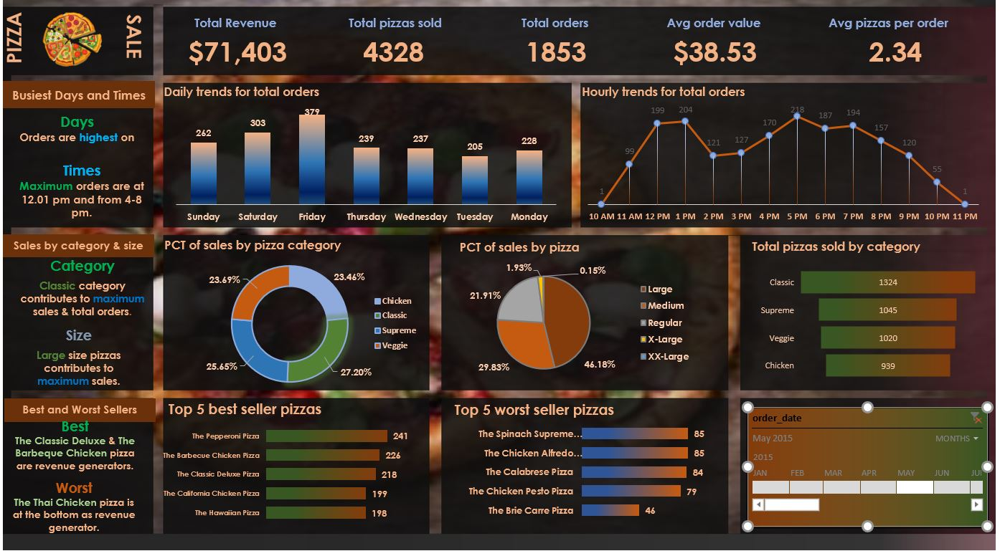

# 🍕 Pizza Sales Dashboard

An interactive **Excel Dashboard** created to analyze pizza sales data.  
This project combines **SQL queries** for data extraction with **Excel PivotTables, PivotCharts, and Slicers** for visualization.  

The dashboard provides actionable insights into revenue, sales trends, and product performance.  

---

## 📊 Dashboard Preview

---

## 🚀 Features & Insights
- **Key Metrics**
  - Total Revenue: **$71,403**
  - Total Pizzas Sold: **4,328**
  - Total Orders: **1,853**
  - Avg Order Value: **$38.53**
  - Avg Pizzas per Order: **2.34**

- **Sales Trends**
  - Daily and Hourly order patterns
  - Busiest days: **Friday, Saturday, Sunday**
  - Peak order times: **12:01 PM** and **4–8 PM**

- **Category & Size Analysis**
  - *Classic* pizzas contribute the most to total sales and orders  
  - *Large* pizzas drive maximum revenue  

- **Product Performance**
  - Best Sellers: *The Pepperoni Pizza*, *The Barbecue Chicken Pizza*  
  - Worst Seller: *The Thai Chicken Pizza*  

- **Interactive Elements**
  - Timeline slicer to filter by date  
  - Slicers for category, size, and pizza types  

---

## 🛠 Tools & Technologies
- **SQL** → Data extraction and querying  
- **Excel** → Data modeling and dashboard creation  
  - PivotTables  
  - PivotCharts  
  - Slicers & Timeline  
  - Conditional Formatting  

---

## 📂 Project Files
- `Pizza_Sales_Dashboard.xlsx` → Excel dashboard file  
- `queries.sql` → SQL queries used for data analysis (previously saved in Word, exported as `.sql`)  
- `Excel Dashboard.JPG` → Dashboard screenshot  

---

## 🔍 How to Use
1. Clone or download this repository.  
2. Open the Excel file to explore the interactive dashboard.  
3. Check the SQL file to see how data was queried and prepared.  

---

## 🎯 Key Learnings
- End-to-end workflow: from SQL data extraction to Excel visualization  
- Building interactive dashboards for business insights  
- Storytelling with data using charts, KPIs, and slicers  

---

## 📌 Author
👩‍💻 *Afsana Azad Sarna*  

✨ This project demonstrates how **data analytics and visualization** can transform raw sales data into meaningful business insights.
